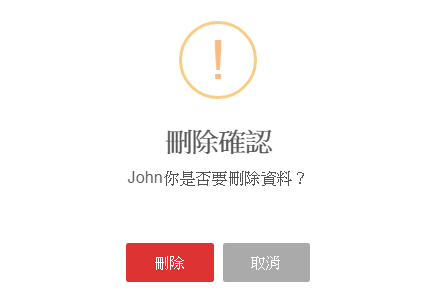

# CrudService

- CRUD是由以下四種系統內常見的功能所組成
    - **C**reate
    - **R**ead
    - **U**pdate
    - **D**elete

> 一定要先做完[前置動作](#api格式)，CRUD的任一功能才能正常運作！

# API格式

| 功能 	| URL                                      	| 
| ---- | ---- |
| 查詢 	| {baseUrl}/api/**{系統名稱}**/get/             	|
| 查詢  	| {baseUrl}/api/**{系統名稱}**/get/**{ID}**             	|
| 新增 	| {baseUrl}/api/**{系統名稱}**/create          	| 
| 修改 	| {baseUrl}/api/**{系統名稱}**/update/**{ID}** 	| 
| 刪除 	| {baseUrl}/api/**{系統名稱}**/delete/**{ID}** 	| 

---

> 目前後台的API大同小異，差別在於「系統名稱」及「查詢的ID」，相同的邏輯以被整合至Service，至於有差異的地方，就需要你幫忙，告訴Service，想呼叫哪個「系統名稱」的API。

## 現有專案的修改方式

由於專案內有多種CRUD的使用方式，目前也已整合為一隻Service，來做為後續系統CRUD的使用方式。


## 前置動作

**無論你要使用CRUD中的哪一項功能，皆必須要先「建立設定檔 」!**

### 建立設定檔

剛剛有提到API格式大致都相同，最主要只差異在「系統名稱」及「查詢的ID」，假如我們要向某個API取得資訊時： 
 - API路徑： myApi.com/api/MyUserInfo  
  - baseUrl : myApi.com  
  - 系統名稱 : MyUserInfo
  
並預期會得到以下的結果：

###### 回傳的JSON

``` js
{
  ID : 1,
  Name : 'John',
  Position : 'Taiwan'
}
```

--

可以先依照API回傳的結果在Angular2專案中建立ViewModel，等等在初始化設定檔時會用到

###### my-user-info.ts

``` js
export class MyUserInfo {
    /** 主索引鍵  */
    ID: string;
    /** 姓名  */
    Name: string;
    /** 位置 */
    Position: string;
}
```


### 初始化CrudService

- 當你開啟component後，只要完成以下二個個步驟，即可完成初始化
    1. 在建構式(constructor)中加入CrudToolService的宣告並在後方指定ViewModel，並設定以下幾個參數，用途請參考範例上的註解
        - systemName
        - dataKey
            - display
            - identifier
    2. 在Module上的providers註冊以下兩個Service
        - CrudToolSerivce
        - CrudToolSweetAlertSerivce
       
#### 1.建立設定檔並初始化

###### my-user-info.component.ts

``` js
...
import { MyUserInfo } from './my-user-info';
import { CrudToolSerivce } from 'app/shared/tools/crudtool.service';

@Component({
    ....
})
export class MyUserInfoComponent implements OnInit { 
    constructor(
        private crudForMyUserInfo : CrudToolSerivce<MyUserInfo>
    ) {
    }

    ngOnInit() {
        /**
    * Crud共用設定檔
    */
    let curdSetting : CrudTool.BaseSetting {
        // 組成URL的重要參數(CRUD皆會使用）
        systemName: 'MyUserInfo',
        dataKey: {
           // 要顯示訊息的欄位名稱 
           // (以Delete為例，假如格式為：「{Name}你是否要刪除資料？」，就會由Json資料產生：「John你是否要刪除資料？」的訊息，可參考下方示意圖）
           display: 'Name',
            // 資料索引鍵的欄位名稱 （Update,Delete 會使用到)
           // 此例使用JSON資料回傳的ID欄位，名稱可依API需求更改為其它名稱
          //  修改 => {baseUrl}/api/MyUserInfo/update/{ID}
          //  刪除 => {baseUrl}/api/MyUserInfo/delete/{ID}
           identifier: 'ID'
        },
    }

    this.crudForMyUserInfo.init(curdSetting);
    }
}

```

Delete示意圖：



#### 2.在NgModule上註冊需要用到的CrudService

後台裡檔案的命名方式可以讓你依照component的名字可以找到相對應的module，那我們在改的component名稱為`my-user-ifno`，所以module就是` my-user-info.module.ts`，打開後，開始註冊需要用到的Service吧！

###### my-user-info.module.ts

``` js

import { CrudToolSerivce } from 'app/shared/tools/crudtool.service';
import { CrudToolSweetAlertSerivce } from 'app/shared/tools/crudtoo-sweetalert.service';

@NgModule({
   ...
    providers: [
        ...
        CrudToolSerivce,
        // 刪除示意圖中使用的alert訊息套件
        CrudToolSweetAlertSerivce
    ],
})
export class MyUserInfoModule { }
```

## 開始使用

### Read

透過共用設定檔向特定的URL，取得資料:
 - 格式：{baseUrl}/api/**{curdSetting.SystemName}**/get/*id*
 - 實際：myApi.com/api/MyUserInfo/get/*id*
 
> ID非必填，若有要查特定資料在傳入即可, 詳細格式可參考最上方API格式裡的「查詢」
 
``` js
this.crudService.get(this.id).subscribe(data => {
    // 處理資料...
});
```

### Create

透過共用設定檔向特定的URL，新增資料:
 - 格式： {baseUrl}/api/**{curdSetting.SystemName}**/create 
 - 實際：myApi.com/api/MyUserInfo/create

> 也可以使用merge方法，完成Create及Update的功能

``` js
this.crudService.create({
   data: {
       Name : 'SomeOne'
   }
});
```

### Update

透過共用設定檔向特定的URL，更新資料:
- 格式：{baseUrl}/api/**{curdSetting.SystemName}**/update/**{curdSetting.identifier}**
- 實際：myApi.com/api/MyUserInfo/update/1
 - 更新JSON資料中ID為1，Name為John的資料
 
> 也可以使用merge方法，完成Create及Update的功能

``` js
this.crudService.update({
   data: : {
       ID : 1
       Name : 'John',
       Position : 'kaohsiung'       
   }
});
```

### Merge

透過指定的Action，决定要將「新增」或「更新」資料

#### 需要新增的資料
假如我們要新增一個SomeOne的資料，而他的主鍵（ID）為「0」或「未設定」，Merge方法判斷主鍵「沒有大於0」或「無法取得」，則會使用「新增（Create)」

```js
this.crudService.merge({
	data: {
      ID : 0,
      Name : "SomeOne"
  }
});
```
#### 需要更新的資料
假如我們要把John的所在地點改為「kaohsiung」，就可以將他的主鍵（ID）放置資料中，Merge方法判斷主鍵大於0，則會使用「更新（Update)」
```js
this.crudService.merge({
	data: {
      ID : 1,
      Name : "John",
      Position : 'kaohsiung'
  }
});
```

#### 說明
``` js
/**
 * 依照主鍵的狀態决定要「新增」或「修改」    
 * 若主鍵為整數 -> 
 * 
 *      新增 ： 小於等於0
 *      修改 ： 大於0    
 * 若主鍵為字串-> 
 * 
 *      新增 ： 字串長度小於等於0
 *      修改 ： 大於0
 */
this.crudService.merge({
	// （非必要）可以在此自訂邏輯，依照頁面的客製需求來决定呼叫的方法
	action: this.isAdd ? CrudTool.action.create : CrudTool.action.update,
  // 要「新增」或「更新」的資料
  data: mergeData
});
```

### Delete

透過共用設定檔向特定的URL，刪除資料:
- 格式：{baseUrl}/api/**{curdSetting.SystemName}**/delete/**{curdSetting.identifier}**
- 實際：myApi.com/api/MyUserInfo/delete/1
  - 刪除JSON資料中ID為1，也就是Name為John的資料

``` js
crudToolService.delete({
	data: : {
    ID : 1
  },
    // 非必填，預設為original，可以使用sweetAlert (CrudTool.DisplayMode.sweetAlert）
	displayMode: CrudTool.DisplayMode.original,
    // 成功之後要跳出的訊息
	success: {
		msg: {
        	// 呈現資料的方式
			dipslayMode: CrudTool.DisplayMode.sweetAlert
		},
		after: (param, base) => {
			// 刪除完成要做的事情(例：隱藏特定的區塊）			
		}
	}
});
```
