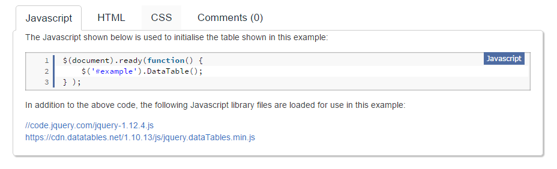
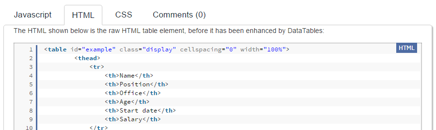

# 簡介

在學習Angular2時，常見的其中一項問題就是如何將之前使用的Jquery套件，搬移至Angular2的專案裡，其實差異只在於HTML、CSS、JS的擺放位置有所不同，之前寫的邏輯基本上都可以直接延用。


那麼在這個專案中會使用Jquery套件是：[Jquery Datatables](https://datatables.net/)，並且透過各小節一步步說明，如何將Jquery套件轉換為Angular2 Component。

# 目錄

目前這份文件的內容會著重在[Jquery Datatables](https://datatables.net/)的基本應用，若要看如何轉換為Component可參考[將Jquery套件轉換為Angula2 Component](#)

目錄如下：
 - 建立Angular2的空專案
 - 載入[Jquery Datatables](https://datatables.net/)所需要的檔案
 - 資料來源改為API
 - 在每一列增加自訂的Html元素

## 建立Angular2的空專案

一開始在可透過以下的指令建立專案，以下的例子會將專案名稱命名為`ngJqDatatable`

> 請記得先安裝Angular Cli，才能使用以下的指令

###### 新增專案的方式

```  js
ng new ngJqDatatable
```

新增完之後大致上的目錄會是（只列出會使用到的檔案，若有其它檔案也不影響）

- src
    - app
        - app.component.html
        - app.component.ts
    - index.html

| 檔案名稱 | 作用 |
|  -- | -- |
| index.html | 首頁 |
| app.component.ts | angular2的組件（預設為首頁所使用） |
| app.component.html | 放置app.component.ts所要使用的Html |


## 載入Jquery Datatables所需要的檔案

在這裡我還是使用常見的Jquery載入套件的方式，讓你暸解到說，其實載入套件的方式並不會受限於你是使用Jquery或Angular2。

以Jquery Datatables的範例：[Zero configuration](https://datatables.net/examples/basic_init/zero_configuration.html)，來做為第一步吧！

  > 若要查看此節完整的檔案記錄可開啟這一個 [版本記錄](https://github.com/lichunbin814/JqDataTable_Angular2/commit/b4ee8931f1e7122f7768c28ac4c7e008f9ed2ae3)

首先把他會使用到的JS、CSS先下載到專案吧


下載後路徑大致如下：

- src
    - assets
        - jquery-datatables
            - css
                - jquery.dataTables.min.css
            - scripts
                - jquery-1.12.4.js
                - jquery.dataTables.min.js
    - app
        - app.component.html
        - app.component.ts
    - index.html



    下載完JS、CSS後就再切到上圖中Html的頁籤，把他全部複製下來，貼到`app.component.html`Component。


若不清楚可參考 [app.component.html 修改記錄](https://github.com/lichunbin814/JqDataTable_Angular2/blob/b4ee8931f1e7122f7768c28ac4c7e008f9ed2ae3/src/app/app.component.html)

--

最後在Index.html，將套件給啟用吧！

[index.html修改記錄](https://github.com/lichunbin814/JqDataTable_Angular2/blob/b4ee8931f1e7122f7768c28ac4c7e008f9ed2ae3/src/index.html)

``` js
$(document).ready(function() {
    $('#example').DataTable();
} );
```

    示意圖（待補）

    ##  資料來源改為API

    實際在專案中使用時，將Server的資料動態的呈現到頁面中也是一個常見的需求，目的在於：
     - 使用者可以在最短的時間內查看到「更新後的資料」

     那麼之前的撰寫方式有哪些限制而導致無法動態呈現呢？
         1. HTML中的每一列資料內容是固定的，需改HTML才能更新資料

    看起來原因在於Html的內容，那修正的方式也很簡單，只要幾個步驟即可：
      1. 移除Table中固定的內容
      2. 透過JS將Server所回傳的內容，動態產生至Table裡特定的區塊內

> 若要查看此節完整的檔案記錄可開啟這一個 [版本記錄](https://github.com/lichunbin814/JqDataTable_Angular2/commit/5e0f01537f4b68764b1abe8be10991d27dca1009)

#### 移除Table中固定的內容

先把app.componet.html中的Tbody的部份全部移除，方便JS之後比較好塞入Server的資料。

[index.html修改記錄](https://github.com/lichunbin814/JqDataTable_Angular2/blob/5e0f01537f4b68764b1abe8be10991d27dca1009/src/app/app.component.html)

``` html
<table id="example" class="display" cellspacing="0" width="100%">
        <thead>
            <tr>
                <th>First name</th>
                <th>Last name</th>
                <th>Position</th>
                <th>Office</th>
                <th>Start date</th>
                <th>Salary</th>
            </tr>
        </thead>
        <tfoot>
            <tr>
                <th>First name</th>
                <th>Last name</th>
                <th>Position</th>
                <th>Office</th>
                <th>Start date</th>
                <th>Salary</th>
            </tr>
        </tfoot>
    </table>
```    

#### 透過JS動態產生內容

在index.html裡，初始化DataTable，要注意的是columns所指定的「順序」及「數量」會對應到app.component.html，所以若是有發生錯誤，可以先來檢查一下是否符合。

``` js
  <script>
    $(document).ready(function () {
      $('#example').DataTable({
        "processing": true,
        "serverSide": true,
        "ajax": {
          "url": "/api/post.php",
          "type": "POST"
        },
        "columns": [
          { "data": "first_name" },
          { "data": "last_name" },
          { "data": "position" },
          { "data": "office" },
          { "data": "start_date" },
          { "data": "salary" }
        ]
      });
    });
  </script>
```

其中ajax的網址是使用[Jquery DataTables範例](https://datatables.net/examples/server_side/simple.html)所提供的Server，但若要直接使用會有CORS（跨網域）的問題，所以需要稍微改Angular2專案的設定。

首先在Src目錄底下新增proxy.conf.json

###### proxy.conf.json
``` js
{
    "/api": {
        "target": "https://datatables.net/examples/server_side/scripts/",
        "changeOrigin": true,
        "pathRewrite": {
            "^/api": ""
        }
    }
}
```

並改用以下指令，啟用專案

> 也可以直接改寫package.json，並透過npm start啟動，改寫方式請參考[版本記錄](https://github.com/lichunbin814/JqDataTable_Angular2/commit/5e0f01537f4b68764b1abe8be10991d27dca1009)

``` js
ng serve --proxy-config proxy.conf.json
```

## 在每一列增加自訂的Html元素

假如說要在每一列新增一個「自訂的按鈕」來執行每一頁的客製邏輯，Jquery Datatables也提供了一個很簡單的方式。

> [版本記錄](https://github.com/lichunbin814/JqDataTable_Angular2/commit/d5829d9142987b1d3bddd99f6c1c09b8de0de1d3)

修改index.html中之前初始化DataTable的方式：
    - 在columns裡增加一個`data`為空字串，並在`render`方法內回傳Html元素
    - 在初始化結束後，針對`render`方法動態產生的元素，綁定事件

``` js
<script>
    $(document).ready(function () {
      $('#example').DataTable({
        .....
        "columns": [
          {
            "data": "",
            "render": function (data, type, row) {
                // 指定了Class
              return '<button class="row-btn">我是按鈕</button>';
            },
        ]
      });

      // 透過Class去取得動態產生的HTML元素
      $("#example").on('click', '.row-btn', function () {
        alert('已點擊');
      })
    });
  </script>

```